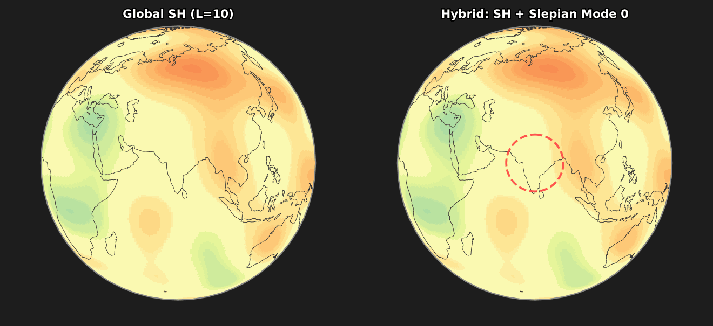

# Localized, High-Resolution Geographic Representations with Slepian Functions

<p align="center">
  
</p>
<p align="center"><sup>Slepian functions concentrate representational capacity where it matters. Left: Global spherical harmonics (L=10) spread energy uniformly. Right: Our hybrid encoder adds Slepian modes concentrated on a region of interest (India), building fine-grained local detail while preserving global context.</sup></p>

## Overview

Geographic data is fundamentally **local**. Disease outbreaks cluster in population centers, ecological patterns emerge along coastlines, and economic activity concentrates within administrative boundaries. Yet standard location encoders—spherical harmonics, Fourier features, grid embeddings—distribute representational capacity *uniformly* across the globe. This creates a resolution bottleneck: to capture fine-grained patterns in California, you need high-frequency basis functions everywhere on Earth. Global spherical harmonics become numerically unstable beyond L≈40, and dense global representations scale poorly. **Slepian functions** solve the *concentration problem*: finding bandlimited functions that maximize energy inside a region of interest. They provide:

- **Spatial concentration** — High-resolution detail exactly where you need it
- **Compact representations** — Dimensionality scales with region size, not the globe
- **Numerical stability** — Reach L=120+ without floating-point issues
- **Pole safety** — Well-defined everywhere on the sphere, including polar regions

Our **hybrid encoder** concatenates:
1. **Regional Slepian basis** at high bandwidth (L=40–120) for local detail
2. **Global spherical harmonics** at low bandwidth (L=10) for context

This bridges the local-global tradeoff: concentrated capacity inside the region, smooth global coverage outside.


## Structure and Usage

```
SlepianPosEnc/
├── src/
│   ├── nn/                              # Neural network architectures (MLP, SIREN, ResMLP, GLU)
│   ├── pe_baselines/                    # Baseline positional encoders
│   ├── spherical_harmonics_ylm.py       # Spherical harmonics implementation
│   ├── supervised_geographic_classification/  # Geographic prediction experiments
│   └── slepian_image_augmentation/           # Image-augmented prediction
├── results/                             # Experiment outputs
├── cache/                               # Precomputed Slepian features
└── visualizations/                      # Figures
```

## Experiments

### 1. Supervised Geographic Prediction

Three tasks comparing Slepian vs baseline positional encoders:
- **California Housing** - Property value regression
- **Japan Prefectures** - 47-class geographic classification
- **Arctic MSS** - Sea surface height regression

See [`src/supervised_geographic_classification/README.md`](src/supervised_geographic_classification/README.md) for details.

### 2. Image-Augmented Geographic Prediction

Building density regression combining satellite image embeddings with Slepian encodings across 4 global regions.

See [`src/slepian_image_augmentation/README.md`](src/slepian_image_augmentation/README.md) for details.

## Requirements

```
python >= 3.9
torch >= 2.0
numpy, scipy, pandas
matplotlib, scikit-learn
pyshtools              # Slepian function computation
```

Additional for image augmentation:
```
earthengine-api        # Google Earth Engine
geopandas, cartopy     # Geospatial visualization
```

## Quick Start

```bash
# Clone with submodules
git clone --recursive https://github.com/your-repo/SlepianPosEnc.git
cd SlepianPosEnc

# Run California Housing experiment (no data download needed)
cd src/supervised_geographic_classification/scripts
bash run_california_experiments.sh
```

<!-- ## Citation

If you use this code, please cite: <update arxiv>
``` -->
